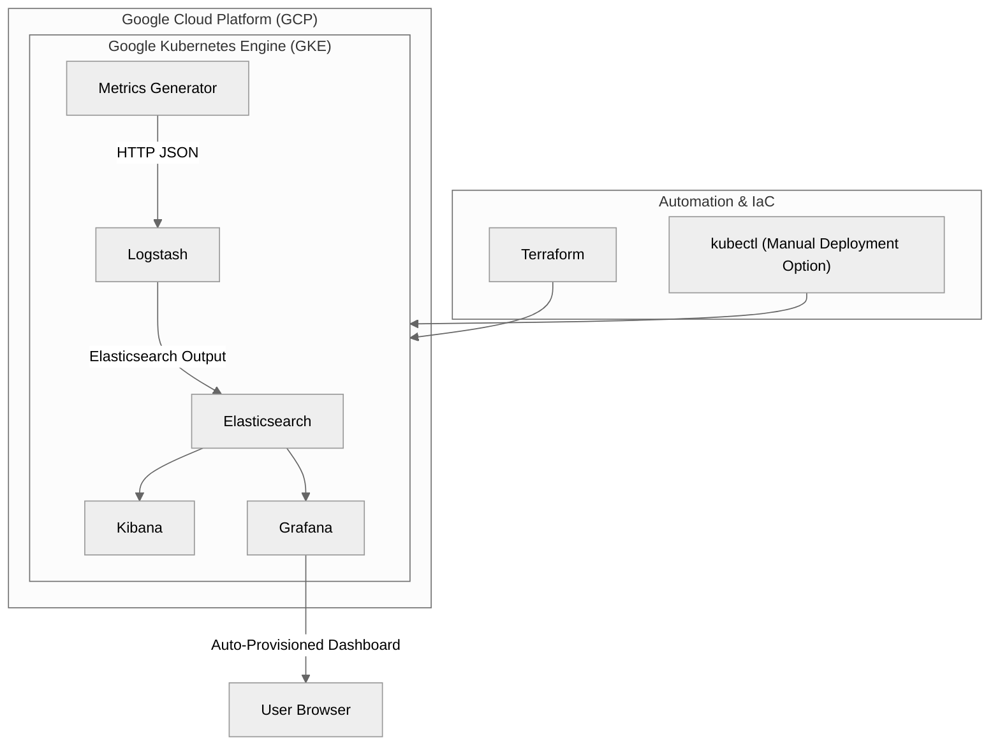

---

## 🧩 `Technical Specification`


# Technical Specification — ELK + Grafana PoC Deployment

## 1. Objective

Demonstrate an **automated observability stack** ingesting and visualizing per-second metrics in Kubernetes, using Terraform automation and Docker Desktop’s local cluster.

---

## 2. Components Overview

| Component             | Purpose                       | Deployment Type        | Key Ports             |
|-----------------------|-------------------------------|------------------------|-----------------------|
| **Elasticsearch**     | Stores metric documents       | Deployment (1 replica) | 9200 (NodePort 30200) |
| **Logstash**          | Receives and forwards metrics | Deployment (1 replica) | 5044 (ClusterIP)      |
| **Kibana**            | Web UI for Elasticsearch      | Deployment (1 replica) | 5601 (NodePort 30002) |
| **Grafana**           | Dashboards and analytics      | Deployment (1 replica) | 3000 (NodePort 30001) |
| **Metrics Generator** | Sends per-second JSON metrics | Deployment (1 replica) | —                     |

---

## 3. Data Flow & Architecture



### ✅ What This Diagram Shows

* GCP hosts the GKE cluster running all ELK + Grafana components.
* Metrics Generator continuously pushes JSON metrics to Logstash.
* Logstash → Elasticsearch → Kibana + Grafana pipeline visualizes metrics per second.
* Terraform automates provisioning; kubectl supports manual deployment.
* Grafana auto-provisions its dashboards and data sources on startup.

```NOTE:``` We are not considering scaling at this stage and we will also need to refactor to deploy into our GCP environment.

Each JSON metric is structured:

```json
{
  "@timestamp": "2025-10-30T15:50:00Z",
  "metric": 42
}
```

## 4. Grafana Provisioning Details

```yaml
type: elasticsearch
url: http://elasticsearch:9200
timeField: "@timestamp"
jsonData:
  interval: "1s"
```

#### Dashboard
* Title: Per Second Metrics
* Panel: Time Series
* Metric: Average(```metric```)
* Interval: 1s
* Refresh: 1s

## 5. Kubernetes Configuration Summary

| Resource    | Type                                                                  | Description                      |
| ----------- | --------------------------------------------------------------------- | -------------------------------- |
| Namespace   | `elk`                                                                 | Logical grouping for stack       |
| Deployments | `elasticsearch`, `logstash`, `kibana`, `grafana`, `metrics-generator` | Core components                  |
| Services    | ClusterIP / NodePort                                                  | Internal & external connectivity |
| ConfigMaps  | `logstash-pipeline`, `grafana-provisioning`, `grafana-dashboards`     | Pipeline & dashboard config      |


## 6. Terraform Integration

Execution:

Terraform uses ```null_resource``` with ```local-exec``` to apply ```kubectl``` commands.

Changes trigger reapply if the ```full-stack-deploymment.yaml``` hash changes.

Outputs:

| Output            | Description      |
| ----------------- | ---------------- |
| grafana_url       | Grafana endpoint |
| kibana_url        | Kibana endpoint  |
| elasticsearch_url | ES API endpoint  |

## 7. Deployment Lifecycle

| Phase       | Step                  | Command                   |
| ----------- | --------------------- | ------------------------- |
| **Init**    | Initialize Terraform  | `terraform init`          |
| **Deploy**  | Create ELK stack      | `terraform apply`         |
| **Verify**  | Check pod status      | `kubectl get pods -n elk` |
| **Access**  | Open Grafana / Kibana | URLs in outputs           |
| **Destroy** | Clean teardown        | `terraform destroy`       |

## 8. Testing Procedures

| Test                    | Command                                            | Expected Result   |
| ----------------------- | -------------------------------------------------- | ----------------- |
| Metric generator output | `kubectl logs deployment/metrics-generator -n elk` | JSON every second |
| Logstash parsing        | `kubectl logs deployment/logstash -n elk`          | Parsed metrics    |
| ES index exists         | `curl localhost:30200/_cat/indices?v`              | `metrics-*`       |
| Grafana dashboard       | Browser                                            | Live 1s updates   |

## 9. Security Limitations

* Refactor to deploy into Google Kubernetes Engine
* Image Attestation
* Add Terraform Kubernetes provider to define resources natively.
* Introduce Helm for managed lifecycle and scaling.
* Enable PersistentVolumes for Elasticsearch data retention.
* Secure endpoints with basic auth + TLS.
* Scalability improvements & Testing
* Backend transient ingest cleanup automation (e.g. 48 hours max, indices maintenance)

## 10. References

* [Elastic Stack Docs](https://www.elastic.co/guide/)
* [Grafana Provisioning Docs](https://grafana.com/docs/grafana/latest/administration/provisioning/)
* [Terraform Docs](https://developer.hashicorp.com/terraform/docs)
* [Docker Desktop Kubernetes]

```Author:``` Andy Longmuir / Platform Engineering
Date: October 2025
Version: 1.0

```yaml

---

### ✅ Highlights

- Terraform provisions the Kubernetes namespace, ConfigMaps, Deployments, and Services for all components.
- Kubernetes hosts the ELK stack (Elasticsearch, Logstash, Kibana) and Grafana for visualization.
- Metrics Generator continuously emits per-second metrics in JSON format via HTTP to Logstash.
- Logstash forwards data to Elasticsearch, which serves as the persistent data layer.
- Kibana and Grafana consume the same data source
- Kibana provides query-level insights.
- Grafana auto-loads a pre-provisioned real-time dashboard.
- User accesses visualizations via browser — Grafana (port 30001) and Kibana (port 30002).
- Included Mermaid Diagrams for architure and sequence
- Fully Markdown-compatible  
- Manual, full stack and terraform deployments
- Included all fixes for Kubernetes + Terraform stack  
- Ready to hand over internally for testing and refactoring into GCP  

---

```
